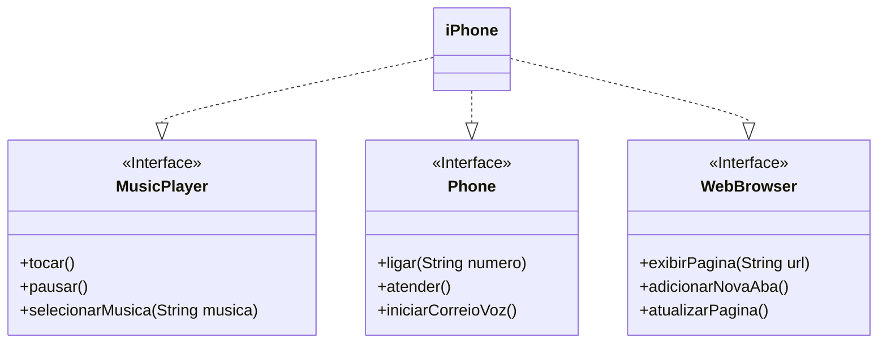

```mermaid
    classDiagram
        class MusicPlayer {
            <<Interface>>
            +tocar()
            +pausar()
            +selecionarMusica(String musica)
        }

        class Phone {
            <<Interface>>
            +ligar(String numero)
            +atender()
            +iniciarCorreioVoz()
        }

        class WebBrowser {
            <<Interface>>
            +exibirPagina(String url)
            +adicionarNovaAba()
            +atualizarPagina()
        }

        class iPhone {
        }

        iPhone ..|> MusicPlayer
        iPhone ..|> Phone
        iPhone ..|> WebBrowser
```